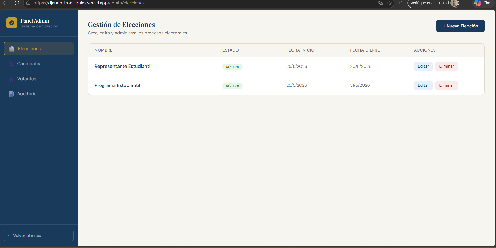
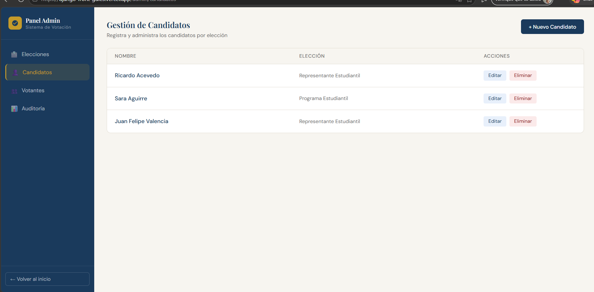
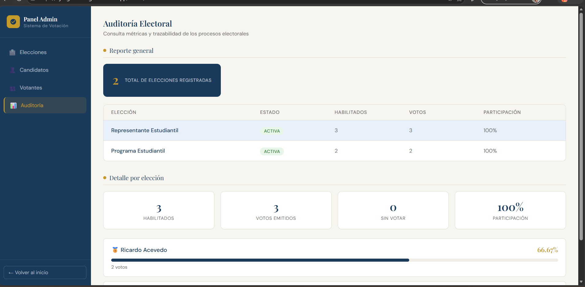

# Sistema de Votación

Profe, este es nuestro sistema de votación. Aquí adjuntamos todo lo solicitado en el entregable 7.

## Capturas

*A continuación se presentan pantallas del sistema en funcionamiento:*

- **Pantalla de Inicio de Sesión:**
  

- **Panel Administrativo - Gestión de Elecciones:**
  

- **Panel Administrativo - Gestión de Candidatos:**
  

- **Panel Administrativo - Gestión de Votantes:**
  

- **Panel Administrativo - Auditoría Electoral:**
  

## Endpoints Probados

*Evidencia de que los endpoints funcionan. Puedes agregar capturas de Postman, Swagger o Insomnia probando las rutas principales.*

### Ejemplos de Endpoints Principales:
- `POST /api/usuarios/login/` - Autenticación y obtención de Token.
- `GET /api/candidatos/` - Listado de candidatos disponibles.
- `POST /api/votos/` - Registro de un voto.
- `GET /api/auditoria/` - Historial de acciones y auditoría.

*Coloca aquí tus capturas de Postman probando estos endpoints:*
- 
- 
- 
- 
- 

## Pasos de Ejecución

Para correr este proyecto en tu entorno local, necesitas tener instalados **Python** y **Node.js**. Sigue estos pasos:

### 1. Clonar el repositorio
```bash
git clone https://github.com/Joners14/proyectoaulaTendencias20261.git
cd proyectoaulaTendencias20261
```

### 2. Levantar el Backend (Django)
Abre una terminal en la carpeta principal del proyecto:
```bash
cd sistemVotacion

# Instalar las dependencias de Python
pip install -r requirements.txt

# Aplicar las migraciones a la base de datos (crea las tablas)
python manage.py migrate

# Iniciar el servidor backend 
python manage.py runserver
```
*(El backend quedará corriendo en `http://localhost:8000`)*

### 3. Levantar el Frontend (React / Vite)
Abre una **nueva terminal** en la carpeta principal del proyecto:
```bash
cd frontend

# Instalar dependencias de Node
npm install

# Correr el servidor de desarrollo del frontend
npm run dev
```
*(El frontend quedará corriendo en la ruta que te indique la terminal, generalmente `http://localhost:5173`)*

## Credenciales de Prueba

Utiliza estas credenciales de ejemplo para ingresar al sistema y probar sus funcionalidades.

| Rol | Usuario / Email | Contraseña |
|---|---|---|
| **Administrador** | `admin` | `admin` |
